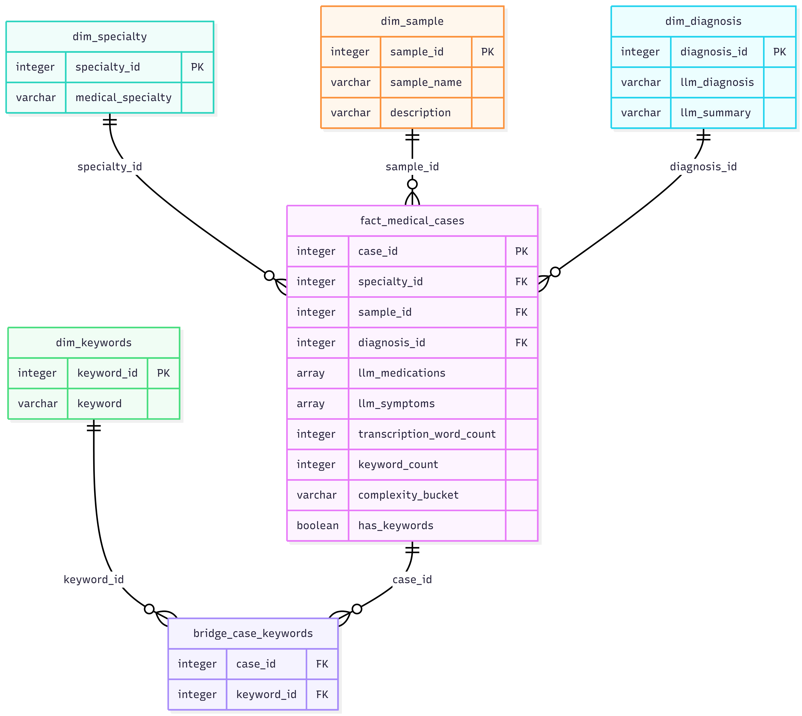

# Medical Transcription Analysis

## Overview
Built an end-to-end pipeline for medical transcription data, processing and transforming raw clinical text into structured insights through scalable workflows and NLP-driven analysis for downstream analytics and reporting.

## Dataset
- Source: Medical transcriptions CSV
- Columns: no, description, medical_specialty, sample_name, transcription, keywords
- Total rows: 4999

## Architecture

## Medallion Architecture
| Layer | Table | Rows | Description |
|-------|-------|------|-------------|
| Bronze | medical_transcriptions | 4999 | Raw ingestion |
| Silver | medical_transcriptions | 4966 | Cleaned + Feature engineered |
| Silver | medical_transcriptions_enriched | 500 | LLM extracted entities |
| Gold | 10 KPI tables + Star Schema | - | Aggregations + Data Model |

## Tech Stack
- Databricks (Serverless)
- Delta Lake
- PySpark
- Mistral AI (LLM)
- GitHub

## Notebooks
| Notebook | Purpose |
|----------|---------|
| 00_setup | Catalog, Schemas, Volume setup |
| 01_ingestion | CSV → Bronze Delta table |
| 02_bronze | Audit & Validation |
| 03_silver | Cleaning + Feature Engineering |
| 04_llm_enrichment | LLM entity extraction |
| 05_gold | 10 KPI tables |
| 06_data_model | Star Schema |

## KPIs
1. Cases by Specialty
2. Complexity Distribution
3. Keyword Frequency
4. Diagnosis Frequency
5. Medication Frequency
6. Symptom Frequency
7. Transcription Length
8. Data Quality
9. Medication per Diagnosis
10. Case Types

## LLM Extracted Fields
- diagnosis
- medications
- symptoms
- summary
